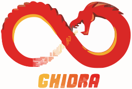

# 💫 About Me:
Computer Science student focused on cybersecurity, reverse engineering, and offensive security. Certified eJPT, with hands-on experience in building practical security projects. Continuously learning, experimenting, and applying technical skills to develop effective solutions for real-world cybersecurity challenges and evolving threat landscapes.

## 🌐 Socials:
 

# 💻 Tech Stack:

<!-- Proudly created with GPRM ( https://gprm.itsvg.in ) -->
<a href="your_link">
  <h3 color="#FF0000">GHIDRA</h3>
</a>
<!--
**rhythmniraula/rhythmniraula** is a ✨ _special_ ✨ repository because its `README.md` (this file) appears on your GitHub profile.

Here are some ideas to get you started:

- 🔭 I’m currently working on ...
- 🌱 I’m currently learning ...
- 👯 I’m looking to collaborate on ...
- 🤔 I’m looking for help with ...
- 💬 Ask me about ...
- 📫 How to reach me: ...
- 😄 Pronouns: ...
- ⚡ Fun fact: ...
-->
